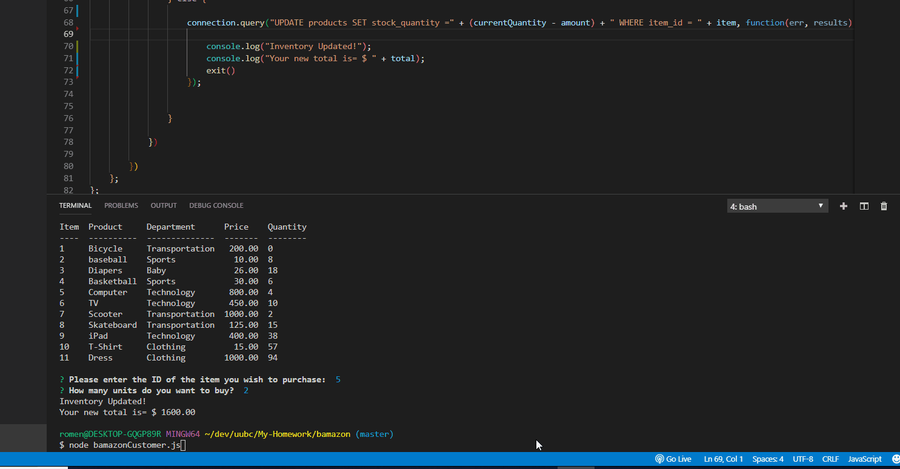

# Bamazon

A store front app using MySQL and Node.js, where you can choose which items you want to buy according to the available inventory.  
You will start by cloning this repo to your device, and then use 'nodemon bamazonCustomer' to begin.

